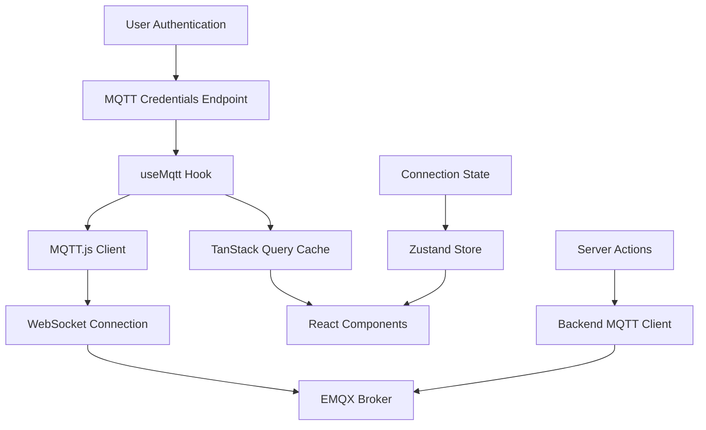
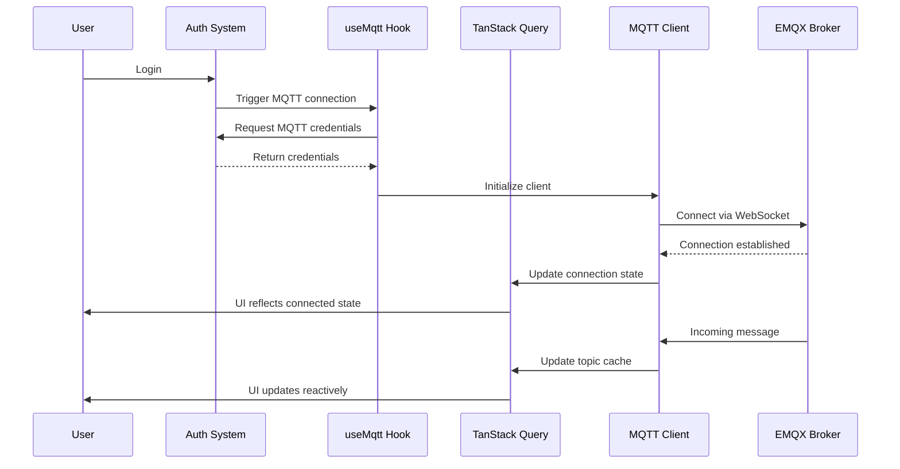

# Design Document

## Overview

Este documento describe el diseño técnico para la implementación de un cliente MQTT v5.0 en el frontend de la aplicación Next.js. La solución se integra con la arquitectura existente que utiliza TanStack Query, Custom Hooks, Server Actions y el sistema de autenticación actual.

La implementación seguirá los patrones establecidos en el proyecto:
- Custom Hooks para encapsular lógica compleja
- TanStack Query para gestión de estado reactivo
- Server Actions para operaciones del servidor
- Zustand para estado global cuando sea necesario
- Integración con el sistema de autenticación existente

## Architecture

### High-Level Architecture



### Component Integration Flow



## Components and Interfaces

### 1. MQTT Configuration Types

```typescript
// src/shared/types/mqtt.types.ts
export interface MqttCredentials {
  brokerUrl: string;
  username: string;
  password: string;
  clientId?: string;
}

export interface MqttConnectionOptions {
  keepalive: number;
  protocolVersion: 5;
  clean: boolean;
  reconnectPeriod: number;
  connectTimeout: number;
  properties?: {
    sessionExpiryInterval?: number;
    receiveMaximum?: number;
    maximumPacketSize?: number;
    topicAliasMaximum?: number;
    requestResponseInformation?: boolean;
    requestProblemInformation?: boolean;
    userProperties?: Record<string, string>;
  };
}

export type ConnectionStatus = 'disconnected' | 'connecting' | 'connected' | 'reconnecting' | 'error';

export interface MqttMessage {
  topic: string;
  payload: string | Buffer;
  qos: 0 | 1 | 2;
  retain: boolean;
  properties?: {
    payloadFormatIndicator?: number;
    messageExpiryInterval?: number;
    topicAlias?: number;
    responseTopic?: string;
    correlationData?: Buffer;
    userProperties?: Record<string, string>;
    subscriptionIdentifier?: number;
    contentType?: string;
  };
}
```

### 2. MQTT Credentials Service

```typescript
// src/shared/services/mqtt-credentials.service.ts
export class MqttCredentialsService {
  static async getMqttCredentials(): Promise<MqttCredentials> {
    // Integrates with existing backend client
    const response = await backend.GET('/api/mqtt/credentials');
    return response.data;
  }
}
```

### 3. MQTT Connection Store (Zustand)

```typescript
// src/shared/stores/mqtt-connection.store.ts
export interface MqttConnectionState {
  status: ConnectionStatus;
  client: MqttClient | null;
  error: string | null;
  lastConnected: Date | null;
  reconnectAttempts: number;
}

export interface MqttConnectionActions {
  setStatus: (status: ConnectionStatus) => void;
  setClient: (client: MqttClient | null) => void;
  setError: (error: string | null) => void;
  incrementReconnectAttempts: () => void;
  resetReconnectAttempts: () => void;
}
```

### 4. useMqtt Custom Hook

```typescript
// src/shared/hooks/use-mqtt.ts
export interface UseMqttOptions {
  autoConnect?: boolean;
  subscriptions?: string[];
  onMessage?: (topic: string, message: MqttMessage) => void;
  onConnect?: () => void;
  onDisconnect?: () => void;
  onError?: (error: Error) => void;
}

export interface UseMqttReturn {
  connectionStatus: ConnectionStatus;
  client: MqttClient | null;
  error: string | null;
  isConnected: boolean;
  subscribe: (topic: string, qos?: 0 | 1 | 2) => Promise<void>;
  unsubscribe: (topic: string) => Promise<void>;
  publish: (topic: string, message: string | Buffer, options?: PublishOptions) => Promise<void>;
  disconnect: () => Promise<void>;
  reconnect: () => Promise<void>;
}
```

### 5. TanStack Query Integration

```typescript
// src/shared/hooks/use-mqtt-topic.ts
export function useMqttTopic<T = any>(topic: string, parser?: (payload: string) => T) {
  const queryClient = useQueryClient();
  const { subscribe, unsubscribe, isConnected } = useMqtt();

  return useQuery({
    queryKey: ['mqtt-topic', topic],
    queryFn: () => {
      // Return cached data or null
      return queryClient.getQueryData(['mqtt-topic', topic]) || null;
    },
    enabled: isConnected,
    staleTime: Infinity, // Data is always fresh from MQTT
  });
}
```

### 6. Server Actions for Publishing

```typescript
// src/shared/actions/mqtt.actions.ts
export async function publishMqttMessage(
  topic: string, 
  payload: string | object,
  options?: PublishOptions
): Promise<{ success: boolean; error?: string }> {
  'use server';
  
  try {
    // Use backend MQTT client to publish
    await backend.POST('/api/mqtt/publish', {
      body: {
        topic,
        payload: typeof payload === 'string' ? payload : JSON.stringify(payload),
        ...options
      }
    });
    
    return { success: true };
  } catch (error) {
    console.error('Failed to publish MQTT message:', error);
    return { 
      success: false, 
      error: error instanceof Error ? error.message : 'Unknown error' 
    };
  }
}
```

## Data Models

### MQTT Message Cache Structure

```typescript
// TanStack Query cache structure for MQTT topics
interface MqttTopicCache {
  [topicKey: string]: {
    topic: string;
    messages: MqttMessage[];
    lastMessage: MqttMessage | null;
    lastUpdated: Date;
    subscribers: number;
  }
}
```

### Connection State Model

```typescript
interface ConnectionStateModel {
  status: ConnectionStatus;
  connectedAt: Date | null;
  disconnectedAt: Date | null;
  reconnectAttempts: number;
  maxReconnectAttempts: number;
  reconnectInterval: number;
  lastError: {
    message: string;
    timestamp: Date;
    code?: string;
  } | null;
}
```

## Error Handling

### Error Categories

1. **Connection Errors**
   - Network connectivity issues
   - Authentication failures
   - Broker unavailability

2. **Message Errors**
   - Malformed JSON payloads
   - Topic permission errors
   - QoS delivery failures

3. **Client Errors**
   - Invalid client configuration
   - Memory leaks
   - Subscription failures

### Error Handling Strategy

```typescript
// Error handling with exponential backoff
class MqttErrorHandler {
  private reconnectAttempts = 0;
  private maxReconnectAttempts = 10;
  private baseReconnectDelay = 1000; // 1 second

  handleConnectionError(error: Error): void {
    console.error('MQTT Connection Error:', {
      message: error.message,
      attempt: this.reconnectAttempts,
      timestamp: new Date().toISOString()
    });

    if (this.reconnectAttempts < this.maxReconnectAttempts) {
      const delay = this.baseReconnectDelay * Math.pow(2, this.reconnectAttempts);
      setTimeout(() => this.attemptReconnect(), delay);
      this.reconnectAttempts++;
    }
  }

  handleMessageError(topic: string, error: Error, rawMessage: string): void {
    console.error('MQTT Message Processing Error:', {
      topic,
      error: error.message,
      rawMessage: rawMessage.substring(0, 100), // Truncate for logging
      timestamp: new Date().toISOString()
    });
  }
}
```

## Testing Strategy

### Unit Tests

1. **useMqtt Hook Tests**
   - Connection lifecycle management
   - Subscription/unsubscription logic
   - Error handling scenarios
   - Cleanup on unmount

2. **TanStack Query Integration Tests**
   - Cache invalidation on message receipt
   - Query state updates
   - Subscription management

3. **Server Actions Tests**
   - Message publishing success/failure
   - Error handling and logging
   - Input validation

### Integration Tests

1. **End-to-End Connection Flow**
   - Authentication → Credentials → Connection
   - Message publishing and receiving
   - Reconnection scenarios

2. **UI Component Integration**
   - Real-time data updates
   - Connection status indicators
   - Error state handling

### Mock Strategy

```typescript
// Mock MQTT client for testing
export class MockMqttClient {
  private subscriptions = new Map<string, Function>();
  private connected = false;

  connect(): Promise<void> {
    this.connected = true;
    return Promise.resolve();
  }

  subscribe(topic: string, callback: Function): void {
    this.subscriptions.set(topic, callback);
  }

  publish(topic: string, message: string): Promise<void> {
    return Promise.resolve();
  }

  // Simulate incoming message for testing
  simulateMessage(topic: string, message: string): void {
    const callback = this.subscriptions.get(topic);
    if (callback) {
      callback(topic, { payload: message });
    }
  }
}
```

## Security Considerations

### Authentication Flow

1. User authenticates with existing system
2. Backend validates session and generates MQTT credentials
3. Credentials are time-limited and tied to user session
4. Frontend receives credentials via secure endpoint
5. MQTT connection uses these temporary credentials

### Data Protection

- Sensitive data (passwords) excluded from client-side logs
- Message payloads sanitized in error logs
- Connection credentials stored securely in memory only
- Automatic cleanup on session expiration

### Topic Security

- Topic access controlled by backend MQTT broker configuration
- User permissions validated before subscription
- Publishing restricted to authorized topics only

## Performance Considerations

### Connection Management

- Single persistent connection per user session
- Automatic reconnection with exponential backoff
- Connection pooling not needed (single user per client)

### Message Handling

- Efficient JSON parsing with error boundaries
- Message deduplication for QoS > 0
- Selective topic subscriptions to minimize bandwidth

### Memory Management

- Automatic cleanup of old messages in cache
- Subscription cleanup on component unmount
- Connection cleanup on session end

### Caching Strategy

- TanStack Query cache for topic-based data
- Infinite stale time for real-time data
- Manual cache invalidation on new messages
- Selective cache clearing on disconnect